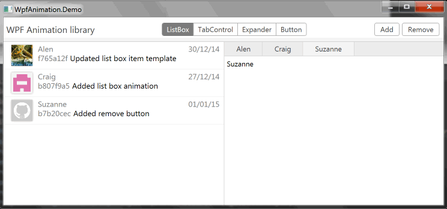

# WPF Animation Library

A library which adds fluent animations for add and remove operations to WPF controls:

- ListBox
- TabControl
- todo

This repository can become a library of animated WPF controls in the future.